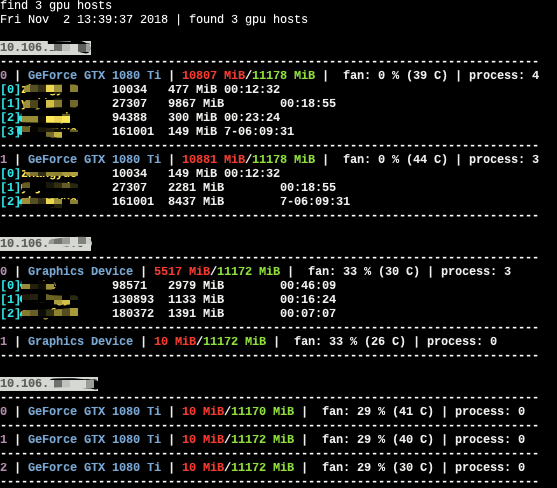

# rgpustat



This is a simple tool allowing you to monitor your gpus from local.
It is convenience where you have to work with multi gpu servers.

Before use this tool, you need to add your public ssh key to your remote servers.
You can also run this command:

```
ssh-copy-id username@ip
```

install dependencies

```
pip3 install paramiko blessings
```

run with

```
python3 remote_gpustat.py --servers username@ip
```

also, you can run with a config file telling the tools where is your gpu servers,for example `servers.txt`

```
username@ip1
username@ip2
username@ip3
```

finally, run the tools to get gpu info.

```
python3 remote_gpustat.py --config_file servers.txt 
```


